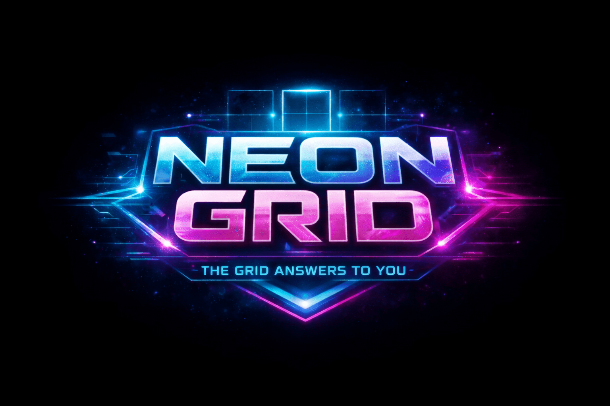

# NEON GRID

'The grid answers to you'

---

This isn’t Tic-Tac-Toe. This is territory control, mind games, and neon dominance.

Welcome to NEON GRID: a cyber-futuristic strategy game where every move is a command, every grid is a battlefield, and victory belongs to the one who controls the board, not luck.

🎮 WHY NEON GRID HITS DIFFERENT

⚡ “Luck fades. Strategy survives.”
Neon Grid takes a simple concept and evolves it into a high-stakes neon showdown. Massive boards, ability-based combat, intelligent AI, and Ultimate Grid mechanics turn every match into a mental warzone.

You don’t just place X or O.

You claim space, deny options, and force mistakes.

🚀 GAME MODES

🎯 VS CPU

“Beat the machine or get outplayed.”
Smart AI that blocks, traps, freezes, and strikes back.

👥 VS PLAYER (Local)

“One screen. One winner.”
Perfect for couch battles and bragging rights.

🌐 ONLINE MODE

“Enter the grid. Find your rival.”
Matchmaking-style experience with cinematic loading.

🟨 FEATURED MODE (9×9)

“Abilities decide wars.”
Power-ups change the board — and the outcome.

🟦 ULTIMATE GRID MODE

“Think bigger. Win smarter.”
Tic-Tac-Toe inside Tic-Tac-Toe.

Territory > tiles.

📐 CHOOSE YOUR BATTLEFIELD

“The bigger the grid, the sharper the mind.”
3×3 – Pure classic

6×6 – Tactical control

9×9 – Strategic pressure

12×12 – Total domination

Custom win conditions keep every grid fair — and brutal.

🧠 POWER-UPS (FEATURED MODE)

“Abilities don’t save you. Timing does.”
Each power-up can be used once per match. Waste it — you lose control.

💣 Bomb – Erase control zones

🧱 Block – Lock the future

🔁 Swap – Steal momentum

⚡ Double Move – Overwhelm the board

❄️ Freeze – Silence the opponent

🟦 ULTIMATE GRID MODE – THE CROWN JEWEL

“Win boards. Claim territory. Rule the grid.”
3×3 grid of mini 3×3 boards

Your move decides your opponent’s battlefield

Win a mini-board → own it

3 owned boards in a row = Victory

No randomness.Only foresight.

🤖 INTELLIGENT AI

“The AI doesn’t panic. It punishes.”
Uses abilities strategically
Breaks streaks before they complete
Freezes at critical moments
Adapts to board size and mode

You win because you’re better — not because it’s easy.

🔊 NEON EXPERIENCE

✨ Cyberpunk neon UI

🎵 Web Audio–powered sound effects

💥 Animated victory strike lines

🎮 Smooth transitions & feedback

Best played with sound ON.

Click here to play ! [https://jashbhai634.itch.io/neon-grid]

This game is best experienced on itch.io

---
Tech Stack :

---
© 2026 CodeMatrix Studio. All rights reserved.

